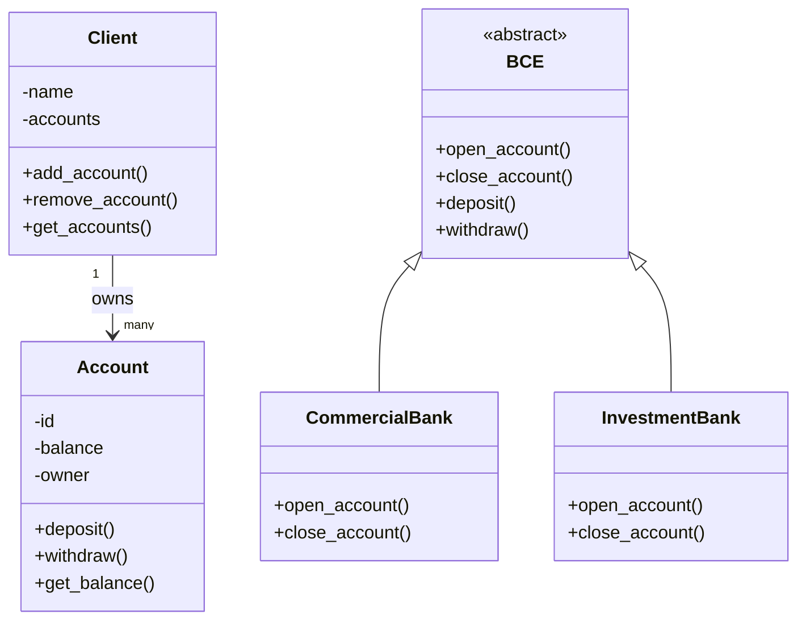

# Banking System – OOP Python Project

## 📌 Overview
This project is a **console-based banking system** written in **Python**, created to demonstrate solid understanding of **Object-Oriented Programming (OOP)** concepts.

The application simulates a real-world banking environment where clients can interact with different types of banks, manage accounts, and perform financial operations such as deposits and withdrawals.

The focus of the project is **clean architecture and business logic**, not UI complexity.

---

## 🎯 Project Goals
- Demonstrate strong OOP fundamentals
- Apply abstraction and inheritance in a real scenario
- Separate responsibilities between entities
- Build extensible and maintainable code

---

## 🏗️ Architecture Overview

The system is built around the following core concepts:
- **Client** owns one or more accounts
- **Account** stores financial and personal data
- **BCE (abstract class)** defines a common interface for banks
- **CommercialBank** and **InvestmentBank** implement specific banking behavior

---

## 🧠 OOP Concepts Used

### ✔ Abstraction
- `BCE` is an abstract base class defining mandatory banking operations.

### ✔ Inheritance
- `CommercialBank` and `InvestmentBank` inherit from `BCE`.

### ✔ Encapsulation
- Account data is managed internally through class methods.

### ✔ Polymorphism
- Different bank types implement the same interface with different logic.

---

## 🔗 Class Relationship Diagram



## 📝Project Structure

```
Banking system OOP/
│
├── app/
│   ├── account.py
│   ├── client.py
│   ├── BCE.py
│   ├── comercial_bank.py
│   ├── investment_bank.py
│   ├── utils.py
│   └── __init__.py
│
├── run.py
├── README.md
├── requirements.txt
├── .env
└── .gitignore
```

### 📁 `app/`
- Core application package
- Contains all business logic and domain models

### `account.py`
- Defines the `Account` entity
- Manages balance operations (deposit, withdraw)
- Ensures financial data integrity

### `client.py`
- Defines the `Client` entity
- Manages one-to-many relationship with accounts

### `BCE.py`
- Abstract base class for all banks
- Defines the required banking interface

### `comercial_bank.py`
- Implements a commercial bank
- Provides standard banking operations

### `investment_bank.py`
- Implements an investment bank
- Demonstrates polymorphic behavior

### `utils.py`
- Utility and helper functions

### `__init__.py`
- Marks the directory as a Python package and contains the main app

### `run.py`
- Application entry point
- Runs the app

### `README.md`
- Project documentation and usage instructions

### `requirements.txt`
- Lists project dependencies

### `.env`
- Stores environment configuration variables

### `.gitignore`
- Specifies files ignored by version control

## ▶️ How to Run the Project

### 1️⃣Clone the repository

```
git clone https://github.com/your-username/your-project.git
cd your-project
```

### 2️⃣Create and activate a virtual environment

```
db_pass=The password of the database
api_key=The api key taken from Alpha Vantage
```

### 3️⃣Install dependencies:

```

pip install -r requirements.txt

```

### 4️⃣Run the application:

```

python run.py

```

## 🧾 Conclusion

This project demonstrates a solid understanding of **Object-Oriented Programming principles** applied to a real-world scenario. The banking system is designed with a clear separation of responsibilities, making the codebase easy to understand, extend, and maintain.

By using abstraction through an abstract base class, inheritance for multiple bank types, and encapsulation of financial data, the project reflects a structured and scalable approach to software design.
